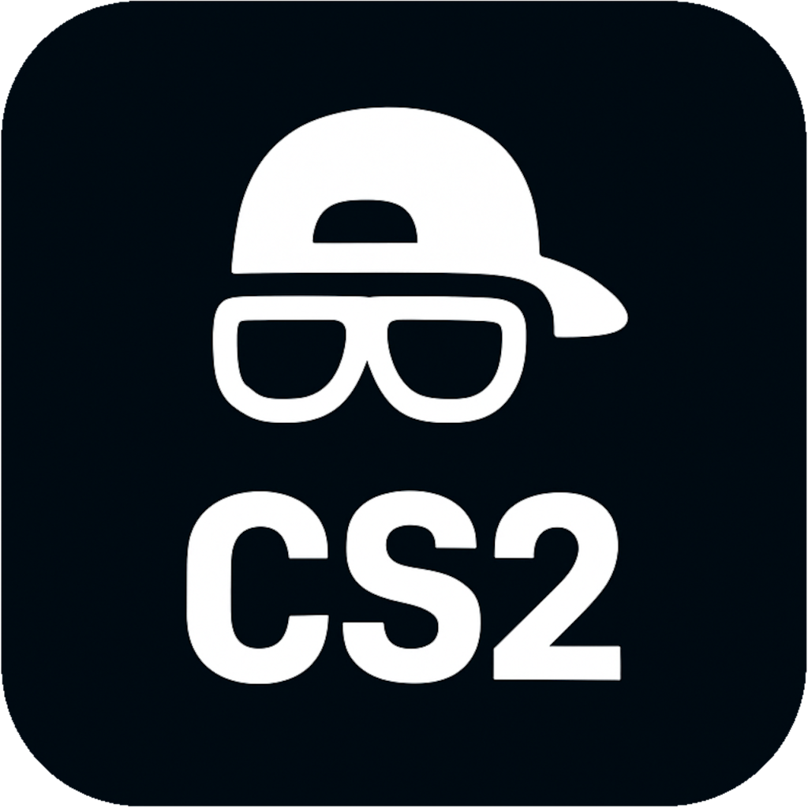
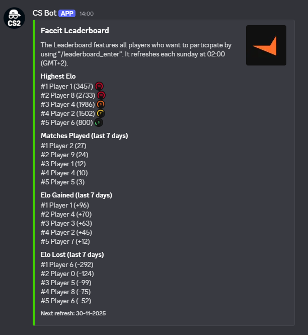
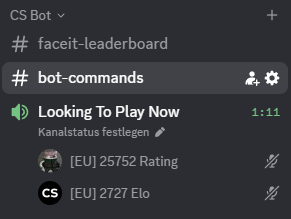

<!DOCTYPE html>
<html lang="en">
<head>
    <meta charset="UTF-8">
    <title>Cool CS Bot</title>
    <link rel="icon" href="images/Bot_Logo.png" type="image/png">
    <meta name="viewport" content="width=device-width, initial-scale=1">
    <link rel="stylesheet" href="styles/style.css">
</head>

<body>

<!-- NAVBAR -->
<nav class="navbar">
    <a class="nav-link active" data-target="home">Home</a>
    <a class="nav-link" data-target="quickstart">Quick Start Guide</a>
    <a class="nav-link" data-target="documentation">Documentation</a>
    <a class="nav-link" data-target="tos">Terms of Service</a>
    <a class="nav-link" data-target="privacy">Privacy Policy</a>
    <!-- <a class="nav-link" data-target="premium">Pricing</a> -->
</nav>

<!-- Lightbox overlay -->

    

<!-- PAGE CONTENT WRAPPER (animated) -->
<main id="content" class="page-transition visible">

    <!-- ====================== HOME ====================== -->
    <section id="home" class="section active">
        <h1>Cool CS Bot</h1>

        

        

            <a class="invite-button" href="YOUR_INVITE_LINK" target="_blank">Invite Bot</a>
        

        

            <h2>A Better Discord Experience</h2>
            

                

                

                    <strong>This bot is built to enhance both user experience and server management</strong>.  
                    Why create dozens of voice channels when users can make their own (with full privacy controls)
                    and the bot cleans everything up automatically? And for CS2 players, nothing beats showing off
                    your Faceit elo or stats, both of which the bot handles with ease!  

                    Plus, you'll never miss a CS2 update again! The bot fetches new patches within minutes and
                    presents the notes in a clean, easy to read format.
                

            

            
            
            

                

                    <ul>
                        <li>
                            <strong>Automated Faceit Elo Tracking</strong>
                            

                                Users can enter their Faceit username and have their elo updated every 24 hours.
                            

                        </li>

                        <li>
                            <strong>Detailed Faceit Match History</strong>
                            

                                View stats for the last 10 games of any player, including Wins, Losses, average ADR and more!
                            

                        </li>

                        <li>
                            <strong>Weekly Faceit Leaderboard</strong>
                            

                                Users can enter themselves into an automatically updated leaderboard where they can flex their
                                current elo, elo gains, elo losses or matches played in the last 7 days!
                            

                        </li>

                        <li>
                            <strong>Voice Channel Management</strong>
                            

                                Users can create their own temporary voice channels with privacy controls:
                                make channels private, require join requests, or hide them entirely.  
                                Server owners can create permanent voice channels. These channels remain active
                                until an Admin deletes them and cannot be made private or hidden by users.
                            

                        </li>

                        <li>
                            <strong>Update Notifications</strong>
                            

                                CS2 updates are fetched within minutes and posted on your server if this feature is
                                activated!
                            

                        </li>

                        <li>
                            <strong>Looking-For-Players Feature</strong>
                            

                                No more spamming "someone from REGION wanting to play CS2 together?" in text channels. Users looking
                                for other CS2 players can create a LFP profile allowing others to add them!
                            

                        </li>

                        <li>
                            <strong>...and many more!</strong>
                            

                                Additional utilities, QoL tools, and CS inspired features designed to
                                enhance your Discord server.
                            

                        </li>
                    </ul>
                

            

        
        

            <h2>Enhanced Voice Channel Functionality and Privacy</h2>
            
  
                <video class="interactive-video" muted playsinline>
                    <source src="videos/Dynamic Channels.mp4" type="video/mp4">
                </video>

                <video class="interactive-video" muted playsinline>
                    <source src="videos/Channel Privacy.mp4" type="video/mp4">
                </video>
            

        

        
        

            <h2>Faceit Stats, LFP and the Queue</h2>
            

                <button class="carousel-btn left">&lt;</button>

                

                    
                    
                    
                

                <button class="carousel-btn right">&gt;</button>
            

        

    

    </section>

    <!-- ====================== DOCUMENTATION ====================== -->
    <section id="documentation" class="section">
        <h1>Documentation</h1>
        
        <h2 class="doc-category-title">Owner Commands</h2>
        <table class="table-doc">
            <tr><th>Command</th><th>Parameters</th><th>Description</th></tr>
            <tr>
                

                    <td>/server_setup</td>
                    <td>None</td>
                

                

                    <td>Let the Bot setup the basics on your server. Creates a Bot Category, Region Roles, a Queue Channel and a Bot Commands channel.</td>
                

            </tr>
            <tr>
                

                    <td>/server_reset</td>
                    <td>None</td>
                

                

                    <td>Let the Bot reset your server. Everything you or a user created in terms of channels will be deleted and everything in the
                    database regarding your server will also be wiped.</td>
                

            </tr>
            <tr>
                

                    <td>/server_leave</td>
                    <td>None</td>
                

                

                    <td>Prompts the Bot to reset your server. Everything you or a user created in terms of channels will be deleted and everything in the
                    database regarding your server will also be wiped. The Bot will also leave the server afterwards.</td>
                

            </tr>
            <tr>
                

                    <td>/server_premium</td>
                    <td>None</td>
                

                

                    <td>Activates premium status for your server, if you have a running subscription on Patreon. 
                    Note: It can take up to 24 hours until the activation is completed. And yes, it will be valid for 31 days
                    from the moment the activation is completed.</td>
                

            </tr>
            <tr>
                

                    <td>/patchnotes_subscribe</td>
                    <td>None</td>
                

                

                    <td>Subscribes the channel the command was run in to receive notifications from the Bot whenever
                        a CS2 update drops.
                    </td>
                

            </tr>
            <tr>
                

                    <td>/patchnotes_unsubscribe</td>
                    <td>None</td>
                

                

                    <td>Removes your server from receiving CS2 patchnotes.</td>
                

            </tr>
            <tr>
                

                    <td>/leaderboard_create</td>
                    <td>None</td>
                

                

                    <td>Creates a leaderboard users can enter. This leaderboard displays various Faceit stats. 
                    If you want to remove the leaderboard, simply delete the created text-channel.</td>
                

            </tr>
            <tr>
                

                    <td>/bot_updates_subscribe</td>
                    <td>None</td>
                

                

                    <td>Subscribes the channel the command was used in to receive development updates of the Bot. 
                    This includes mostly planned downtimes or incoming bugfixes.</td>
                

            </tr>
            <tr>
                

                    <td>/bot_updates_unsubscribe</td>
                    <td>None</td>
                

                

                    <td>Removes any set channel for Bot updates from receiving notifications.</td>
                

            </tr>
            <tr>
                

                    <td>/ban</td>
                    <td>discord_name</td>
                

                

                    <td>Bans the user from using any feature of the Bot on your server for 1 year and deletes all associated data
                        (e.g. Leaderboard entry, LFP profile, etc.). 
                        Note: discord_name is the unique profile name of the user (formerly name#1234), not their changable nickname on your server.
                    </td>
                

            </tr>
            <tr>
                

                    <td>/unban</td>
                    <td>discord_name</td>
                

                

                    <td>Lifts the server wide ban from a user and allows them to use the bot again.
                    </td>
                

            </tr>
        </table>

        <h2 class="doc-category-title">Faceit Commands</h2>
        <table class="table-doc">
            <tr><th>Command</th><th>Parameters</th><th>Description</th></tr>
            <tr>
                

                    <td>/track_player</td>
                    <td>faceit_name</td>
                

                

                    <td>Tracks the elo of the entered Faceit Nickname. 
                        The elo will be refreshed every 24 hours.</td>
                

            </tr>
            <tr>
                

                    <td>/untrack_player</td>
                    <td>None</td>
                

                

                    <td>Stops tracking the elo of the Faceit Nickname you entered before.</td>
                

            </tr>
            <tr>
                

                    <td>/faceit_stats</td>
                    <td>faceit_name</td>
                

                

                    <td>Displays various stats (e.g. average ADR, K/R, etc.) of the last 10 games played
                        by the entered Faceit Player.
                    </td>
                

            </tr>
            <tr>
                

                    <td>/leaderboard_enter</td>
                    <td>None</td>
                

                

                    <td>Inserts you into the Faceit Leaderboard of a server if one has been created. 
                        Note: This command requires you to track your Faceit account using "/track_player".</td>
                

            </tr>
            <tr>
                

                    <td>/leaderboard_leave</td>
                    <td>None</td>
                

                

                    <td>Removes you from the Faceit Leaderboard of a server the next time it is updated.</td>
                

            </tr>
        </table>

        <h2 class="doc-category-title">Looking For Players Commands</h2>
        <table class="table-doc">
            <tr><th>Command</th><th>Parameters</th><th>Description</th></tr>
            <tr>
                

                    <td>/lfp_create</td>
                    <td>None</td>
                

                

                    <td>Sends you a DM that walks you through the provess of creating a LFP profile. 
                        Note: Creating a profile is required to match other players.</td>
                

            </tr>
            <tr>
                

                    <td>/lfp_update</td>
                    <td>None</td>
                

                

                    <td>Lets you update/change any value in your LFP profile.</td>
                

            </tr>
            <tr>
                

                    <td>/lfp_delete</td>
                    <td>None</td>
                

                

                    <td>Deletes your LFP profile and assoicated data in the database. 
                        Note: This needs to be done on each server where you created a profile.
                    </td>
                

            </tr>
            <tr>
                

                    <td>/lfp_extend</td>
                    <td>None</td>
                

                

                    <td>Extends the duration of your LFP profile by 14 days. 
                        Note: After 14 days of inactivity (you not using any /lfp commands), your profile
                        will be automatically deleted. 
                        Note: A few days before your profile would get deleted, the Bot sends you a notifications
                        that deletion is imminent.
                    </td>
                

            </tr>
            <tr>
                

                    <td>/lfp</td>
                    <td>None</td>
                

                

                    <td>Lets you look through other LFP profiles on this server.</td>
                

            </tr>
        </table>

        <h2 class="doc-category-title">Voice Channel Commands</h2>
        <table class="table-doc">
            <tr><th>Command</th><th>Parameters</th><th>Description</th></tr>

            <tr>
                

                    <td>/voice_create</td>
                    <td>None</td>
                

                

                    <td>Creates a temporary voice channel. After all users have left, the channel will be deleted. 
                    The host of a voice channel can change its privacy setting.</td>
                

            </tr>
            <tr>
                

                    <td>/voice_create_permanent</td>
                    <td>None</td>
                

                

                    <td>Creates a permanent voice channel. After all users have left, the channel will be reset to its default state. 
                    Note: Only a server admin can use this command!</td>
                

            </tr>
            <tr>
                

                    <td>/voice_close</td>
                    <td>None</td>
                

                

                    <td>Makes the voice channel private. Other users need to use /voice_join to send a join request. 
                    Note: Permanent voice channels cannot be closed.</td>
                

            </tr>
            <tr>
                

                    <td>/voice_open</td>
                    <td>None</td>
                

                

                    <td>Makes the voice channel public. Other users can join freely. 
                    Note: Permanent voice channels cannot be opened.</td>
                

            </tr>
            <tr>
                

                    <td>/voice_join</td>
                    <td>lobby_id</td>
                

                

                    <td>Sends a join request to the voice channel of "lobby_id". 
                    Note: The lobby ID will be displayed in the channel upon running "/voice_close".</td>
                

            </tr>
            <tr>
                

                    <td>/voice_hide</td>
                    <td>None</td>
                

                

                    <td>Makes the voice channel hidden. Other users are not able to see it in the Server. 
                        Note: Permanent voice channels cannot be hidden. 
                        Note: This feature is a toggle, so to reveal a channel you need to run the command again.</td>
                

            </tr>
            <tr>
                

                    <td>/voice_toggle_elo</td>
                    <td>None</td>
                

                

                    <td>Replaces the channel name with the average Faceit Elo or Premier Rating of all users in the channel. 
                    Note: This feature is a toggle that switches between Faceit Elo, Premier Rating and the default naming scheme.</td>
                

            </tr>
            <tr>
                

                    <td>/shuffle</td>
                    <td>None</td>
                

                

                    <td>Splits all users in a channel into two evenly balanced teams in terms of their Faceit Elo. 
                        Note: This feature requires at least two users in a channel and will ignore all users who haven't set their Faceit elo yet.</td>
                

            </tr>
        </table>

        <h2 class="doc-category-title">General User Commands</h2>
        <table class="table-doc">
            <tr><th>Command</th><th>Parameters</th><th>Description</th></tr>
            <tr>
                

                    <td>/elo_set</td>
                    <td>faceit_elo premier_rating</td>
                

                

                    <td>Sets your Faceit Elo and/or your Premier Rating. 
                        Note: These values will be used when creating a LFP profile.</td>
                

            </tr>
            <tr>
                

                    <td>/elo_show</td>
                    <td>None</td>
                

                

                    <td>Displays your current set Faceit Elo and Premier Rating.</td>
                

            </tr>
            <tr>
                

                    <td>/region</td>
                    <td>None</td>
                

                

                    <td>Lets you choose your region, which will then be assigned to you as a server role. 
                        Note: This is required for creating a LFP profile and the Looking To Play Now feature.</td>
                

            </tr>
            <tr>
                

                    <td>/queue_mode</td>
                    <td>None</td>
                

                

                    <td>Switches between your Faceit Elo or Premier Rating elo being displayed in the Looking To Play Now channel.</td>
                

            </tr>
            <tr>
                

                    <td>/delete_data</td>
                    <td>None</td>
                

                

                    <td>Deletes any and all stored data of your Discord user-id in the database of the bot. 
                        Note: If you are on multiple servers using this bot, you only need to run the command
                        once to delete all data entries from all servers.</td>
                

            </tr>
            <tr>
                

                    <td>/clutch</td>
                    <td>situation</td>
                

                

                    <td>Simulates your performance in a 1vX situation. 
                        Note: You can improve the odds of a positive roll by setting your Faceit elo. The higher your elo, the higher the chances of a successful clutch!</td>
                

            </tr>
        </table>

    </section>

    <!-- Quick Start Guide Section -->
    <section id="quickstart" class="section">
        

            

                <h2>Quick Start Guide</h2>
            

            <ol class="qs-list">
                <li>
                    <h3>1. Invite the Bot</h3>
                    
Add the bot to your Discord server using the official invite link (Home section).

                </li>

                <li>
                    <h3>2. Permissions</h3>
                    
Assign the Bot the required permissions by right clicking your server icon -> server settings -> roles and move the CS Bot all the way to the top.

                </li>

                <li>
                    <h3>3. Setup your Server</h3>
                    
Use <code>/server_setup</code> to let the Bot create the basic channels required for some of its commands. 
                        You can move them around freely after, as long as they remain in the CS Bot category.

                </li>

                <li>
                    <h3>4. Explore Commands</h3>
                    
Take a look at the Documentation section to get an idea of what the Bot is capable of.

                </li>

                <li>
                    <h3>5. Bonus Tip</h3>
                    
Use <code>/leaderboard_create</code> to create a weekly (or more frequently) updated Leaderboard featuring all kinds of Faceit stats of participating 
                        server members over the last 7 days.

                </li>
            </ol>
        

    </section>

    <!-- ====================== TOS ====================== -->
    <section id="tos" class="section">
        

            <h1>Terms of Service</h1>
            
<strong>Last Updated:</strong> 19.11.2025

            

            These Terms of Service ("Terms") govern your access and use of the Cool CS Bot Discord bot. 
            By using the Bot, you agree to these Terms. If you do not agree, you must not use the Bot.
            

            <h2>1. Eligibility</h2>
                

                You must meet the minimum age requirements set by Discord’s Terms of Service. By using the Bot, 
                you confirm that you satisfy these requirements.
                

            <h2>2. Description of the Service</h2>
                
The Bot offers optional features, including:

                <ol>
                    <li>Leaderboards for Faceit related statistics</li>
                    <li>Faceit related statistics of past matches and your elo</li>
                    <li>Looking For Players (LFP) profiles and profile matching</li>
                    <li>Automated CS2 updates and Bot updates</li>
                    <li>Enhanced Voice Channel management</li>
                </ol>
                
All features are provided "as-is" and may be added, removed, or modified at any time.

            <h2>3. User-Generated Content & User Responsibility</h2>
                
Users may submit information such as Faceit usernames, their region, spoken languages, 
                and other player information. Users are solely responsible for the content they submit and their interactions with others.

                
The Bot operator is not liable for:

                <ol>
                    <li>User behavior, harassment, spam, or abuse</li>
                    <li>Accuracy of user-submitted information</li>
                    <li>DMs exchanged between users</li>
                </ol>
                

            <h2>4. Acceptable Use & Anti-Abuse Policy</h2>
                
Users agree not to:

                <ol>
                    <li>Spam commands or automate usage of the Bot</li>
                    <li>Exploit, attack, overload, or reverse-engineer the Bot</li>
                    <li>Use the Bot for harassment, threats, stalking, or impersonation</li>
                    <li>Manipulate leaderboard data or misuse the LFP system</li>
                    <li>Bypass rate limits or command restrictions</li>
                </ol>
                
The operator may restrict or ban users violating these Terms.

            <h2>5. Data Collection & GDPR Compliance</h2>
                
The Bot collects only data required to operate its features, including:

                <ol>
                    <li>Discord User ID</li>
                    <li>Faceit username and public stats</li>
                    <li>LFP profile fields (region, country, spoken languages)</li>
                    <li>Timestamps for updates and participation</li>
                </ol>
                

            <h3>Purpose of Storage</h3>
                
Data is used exclusively for Bot features such as, but not limited to, leaderboards,
                LFP searches, and abuse prevention.

                <h3>User Rights</h3>
                
Users may request to view, modify, or delete their stored data at any time using provided commands.

                <h3>Data Retention</h3>
                

                LFP related DMs auto-delete after 24 hours.  
                Data is erased once a user opts out (by using the provided commands), a user leaves a server or a user does not
                actively use the Bot for 30 days. Created LFP profiles are deleted after 14 days of inactivity (not using any LFP features).
                

            <h3>Data Protection</h3>
                

                Reasonable security measures are applied, 
                but no system guarantees absolute security.  
                Users accept this risk.
                

            <h2>6. No Warranty / Service Provided "As Is"</h2>
                

                The Bot is provided without any warranties regarding uptime, accuracy, availability, reliability, 
                or error-free operation. Service interruptions may occur.
                

            <h2>7. Limitation of Liability</h2>
                
To the fullest extent permitted by law, the Bot operator is not liable for:

                <ol>
                    <li>User interactions or misconduct</li>
                    <li>Loss, corruption, or exposure of data</li>
                    <li>Service downtime, bugs, or errors</li>
                    <li>Unauthorized access, hacking, or malicious activity</li>
                    <li>Indirect, incidental, or consequential damages</li>
                </ol>
                
Users interact with the Bot at their own risk.

            <h2>8. Server-Level Bans</h2>
            

                Server owners and administrators have the authority to ban users from using the bot’s features within their server at any time and for any reason in accordance with their own community rules.
            

            

                Such bans remain active for a period of <strong>1 year</strong>, during which the affected user cannot request deletion of the minimal data required to maintain the ban. 
            

            

                For all matters related to how ban-related data is stored and retained please refer to the corresponding section in the Privacy Policy.
            

            <h2>9. Right to Modify or Discontinue Service</h2>
                

                The operator may update, change, suspend, or discontinue the Bot at any time without notice.
                Continuation of use after updates implies acceptance of revised Terms.
                

            <h2>10. Termination</h2>
                

                The operator may restrict or terminate access for any user who violates these Terms.  
                Users may delete their data or stop using the Bot at any time.
                

            <h2>11. Governing Law</h2>
                

                These Terms are governed by the laws applicable in the operator’s jurisdiction unless overridden by regional legal requirements.
                

            <h2>12. Contact</h2>
                

                For inquiries contact: sebcs.cs2@gmail.com
                

        

    </section>

    <!-- ====================== PRIVACY POLICY ====================== -->
    <section id="privacy" class="section">
        

            <h1>Privacy Policy</h1>
            

                This Privacy Policy explains what data the Bot collects, why it is collected, how long it is stored,
                and how users may request deletion. By using the Bot, you consent to the processing of the data
                described below for the purposes outlined.
            

            <!-- ---------------------------------------------------------------------- -->
            <h2>1. Data Controller</h2>
            

                The Data Controller for all processing carried out by the Bot is the Bot’s developer/owner.
                Contact information is provided at the bottom of the Terms Of Service.
            

            <!-- ---------------------------------------------------------------------- -->
            <h2>2. Data Collected Automatically</h2>
            <h3>2.1 Guild Information</h3>
            <ul>
                <li>Guild ID</li>
                <li>User ID of the server owner</li>
            </ul>
            
<strong>Purpose:</strong> Required for bot functionality, command handling, and server-specific configuration.

            
<strong>Retention:</strong> Until the Bot is kicked, banned, or manually prompted to leave the server.

            <h3>2.2 Dynamic Voice Channel System</h3>
            <h4>Temporary Channels</h4>
            <ul>
                <li>Guild ID</li>
                <li>Voice Channel ID</li>
                <li>Host User ID (first user joining an empty channel)</li>
            </ul>
            
<strong>Purpose:</strong> Managing dynamic voice channel ownership and lifecycle.

            
<strong>Retention:</strong>

            

                • Host User ID is deleted as soon as the user leaves the channel. 
                • Channel data is deleted as soon as the channel becomes empty.
            

            <h4>Permanent Channels</h4>
            <ul>
                <li>Guild ID</li>
                <li>Voice Channel ID</li>
                <li>Host User ID (first user joining an empty channel)</li>
            </ul>
            
<strong>Purpose:</strong> Provide persistent voice channels managed by the Bot.

            
<strong>Retention:</strong>

            
 
                • Host User ID is deleted as soon as the user leaves the channel. 
                • Channel Data: Until a server admin or server owner deletes the channel.
            

            <!-- ---------------------------------------------------------------------- -->
            <h2>3. Patchnote Notification System</h2>
            <ul>
                <li>Guild ID</li>
                <li>Channel ID</li>
            </ul>
            
<strong>Purpose:</strong> Sending CS2 update notifications and Bot update messages.

            
<strong>Retention:</strong> Until a server admin unsubscribes from notifications using the according command.

            <!-- ---------------------------------------------------------------------- -->
            <h2>4. Premium Server Data</h2>
            <ul>
                <li>Guild ID</li>
                <li>Premium tier information</li>
                <li>Date until Premium is valid</li>
            </ul>
            
<strong>Purpose:</strong> Determine premium feature access.

            
<strong>Retention:</strong> Until the premium period ends.

            <!-- ---------------------------------------------------------------------- -->
            <h2>5. User-Provided Data (Faceit & CS2 Statistics)</h2>
            <ul>
                <li>Faceit Elo</li>
                <li>Premier Rating</li>
                <li>Faceit Nickname</li>
                <li>Region</li>
            </ul>
            
<strong>Purpose:</strong> Enable leaderboard features and personalized statistics.

            
<strong>Retention:</strong>

            

                • Until the user deletes their data via <code>/delete_data</code>, OR 
                • After 30 days of inactivity (no functionality of the Bot used).
            

            <!-- ---------------------------------------------------------------------- -->
            <h2>6. Player Profile (LFP System)</h2>
            
For the Looking-For-Players system, the following data is stored:

            <ul>
                <li>User ID</li>
                <li>Region</li>
                <li>Country</li>
                <li>Primary and Secondary Languages</li>
            </ul>
            
<strong>Purpose:</strong> Allow players to create searchable profiles to find potential teammates.

            <h3>6.1 Data Visibility</h3>
            

                Search results anonymize usernames (e.g. "Player#VWXYZ").  
                When a like/connection is sent, the receiving user temporarily sees the sender’s full Discord username in order to allow them 
                to add the sender as a friend on Discord.
            

            <h3>6.2 Data Retention</h3>
            

                • Until the user deletes their profile via <code>/lfp_delete</code> or deletes all data via <code>/delete_data</code>, OR  
                • After 14 days of inactivity.
            

            

                Users will be notified shortly before automatic deletion and may choose to extend storage for another 14 days.
            

            <!-- ---------------------------------------------------------------------- -->
            <h2>7. Message Storage</h2>
            

                Direct messages created by the Bot for LFP connection requests automatically delete themselves
                after 24 hours to maintain privacy and prevent unnecessary data retention.
            

            <!-- ---------------------------------------------------------------------- -->
            <h2>8. Data Security</h2>
            

                All data is stored on a restricted-access server. 
                Access is limited to the Bot’s developers. 
                No data is shared with third parties.
            

            <!-- ---------------------------------------------------------------------- -->
            <h2>9. User Rights (GDPR)</h2>
            
Users have the following rights at any time:

            <ul>
                <li>Right to access their stored data</li>
                <li>Right to request correction of inaccurate data</li>
                <li>Right to request deletion of their data via <code>/delete_data</code></li>
                <li>Right to withdraw consent by discontinuing use of the Bot</li>
            </ul>
            

            <!-- ---------------------------------------------------------------------- -->
            <h2>10. Retention of Minimal Data for Abuse Prevention</h2>
            <ul>
                <li>User ID</li>
            </ul>

            
<strong>Purpose:</strong> Abuse and misuse prevention.

            
<strong>Retention:</strong> 1 year starting from the day of the ban.

            

                In cases of misuse, spam, or malicious activity, the Bot may retain a minimal record consisting solely of the user’s Discord User ID
                for the purpose of enforcing bans or preventing repeated abuse. 
                This retention is based on the Bot Operator’s legitimate interest in maintaining the security and integrity of the service (GDPR Art. 6(1)(f), Recital 49).  
                This data: 
            

            <ul>
                <li>is the minimum necessary to enforce a ban</li>
                <li>is not used for any other purpose</li>
                <li>is not displayed publicly</li>
                <li>is retained only as long as the ban is active</li>
            </ul>
            
            

                Users may not request deletion of this specific data while a ban is active, as permitted under GDPR Art. 17(3)(e).
            

            <!-- ---------------------------------------------------------------------- -->
            <h2>11. Changes to This Policy</h2>
            

                This Privacy Policy may be updated to reflect improvements or changes in the Bot's functionality. 
                Continued use of the Bot implies acceptance of the latest version.
            

        

    </section>

    <!-- ====================== PREMIUM ====================== -->
    <section id="premium" class="section hidden">
        

            

                All essential features are available for free. Premium upgrades unlock additional functionality, extend data and performance limits, 
                and provide access to enhanced tools such as faster Faceit syncing, more profile slots, and advanced voice-channel features.
            

        

        <h1>Pricing</h1>
        

            <h2>Free Tier</h2>
            <table class="table">
                <tbody class="always-visible">
                    <tr><th>Feature</th><th>Included</th></tr>
                    <tr><td>Patchnotes</td><td>✔</td></tr>
                    <tr><td>Leaderboard</td><td>Basic</td></tr>
                    <tr><td>Faceit Stats</td><td>Basic</td></tr>
                    <tr><td>Leaderboard Sync</td><td>Every 168h</td></tr>
                </tbody>
            </table>

            

                
Show More

                

                    <table class="table">
                        <tbody class="collapsible-content">
                            <tr><td>LFP Profiles</td><td>5</td></tr>
                            <tr><td>Daily LFP Likes</td><td>1</td></tr>
                            <tr><td>Queue Slots</td><td>10</td></tr>
                            <tr><td>Shuffle Teams</td><td>No</td></tr>
                            <tr><td>VC Permanent</td><td>1</td></tr>
                            <tr><td>VC Temporary</td><td>3</td></tr>
                            <tr><td>VC Tools</td><td>Basic</td></tr>
                        </tbody>
                    </table>
                

            

        

        

            

                <h2>Plus</h2>
                <h3>2.50$ / Month</h3>
                <table class="table">
                        <tr><th>Feature</th><th>Included</th></tr>
                        <tr><td>Premium Servers</td><td>1</td></tr>
                        <tr><td>Leaderboard</td><td>Full</td></tr>
                        <tr><td>Leaderboard Sync</td><td>Every 168h</td></tr>
                        <tr><td>Faceit Stats</td><td>Full</td></tr>
                        <tr><td>LFP Profiles</td><td>15</td></tr>
                        <tr><td>Daily LFP Likes</td><td>2</td></tr>
                        <tr><td>Queue Slots</td><td>15</td></tr>
                        <tr><td>Shuffle Teams</td><td>✔</td></tr>
                        <tr><td>VC Permanent</td><td>3</td></tr>
                        <tr><td>VC Temporary</td><td>7</td></tr>
                        <tr><td>VC Tools</td><td>Full</td></tr>
                </table>
            

            

                <h2>Premium</h2>
                <h3>6$ / Month</h3>
                <table class="table">
                        <tr><th>Feature</th><th>Included</th></tr>
                        <tr><td>Premium Servers</td><td>2</td></tr>
                        <tr><td>Leaderboard</td><td>Full</td></tr>
                        <tr><td>Leaderboard Sync</td><td>Every 72h</td></tr>
                        <tr><td>Faceit Stats</td><td>Full</td></tr>
                        <tr><td>LFP Profiles</td><td>30</td></tr>
                        <tr><td>Daily LFP Likes</td><td>3</td></tr>
                        <tr><td>Queue Slots</td><td>20</td></tr>
                        <tr><td>Shuffle Teams</td><td>✔</td></tr>
                        <tr><td>VC Permanent</td><td>5</td></tr>
                        <tr><td>VC Temporary</td><td>15</td></tr>
                        <tr><td>VC Tools</td><td>Full</td></tr>
                </table>
            

            
            

                <h2>Ultra</h2>
                <h3>12.50$ / Month</h3>
                <table class="table">
                        <tr><th>Feature</th><th>Included</th></tr>
                        <tr><td>Premium Servers</td><td>3</td></tr>
                        <tr><td>Leaderboard</td><td>Full</td></tr>
                        <tr><td>Leaderboard Sync</td><td>Every 24h</td></tr>
                        <tr><td>Faceit Stats</td><td>Full</td></tr>
                        <tr><td>LFP Profiles</td><td>100</td></tr>
                        <tr><td>Daily LFP Likes</td><td>5</td></tr>
                        <tr><td>Queue Slots</td><td>30</td></tr>
                        <tr><td>Shuffle Teams</td><td>✔</td></tr>
                        <tr><td>VC Permanent</td><td>10</td></tr>
                        <tr><td>VC Temporary</td><td>30</td></tr>
                        <tr><td>VC Tools</td><td>Full</td></tr>
                </table>
            

        

    </section>

</main>

<footer class="footer">© Cool CS Bot Developer</footer>

<!-- ====================== JS: Page Switching + Fade Animation ====================== -->

</body>
</html>
